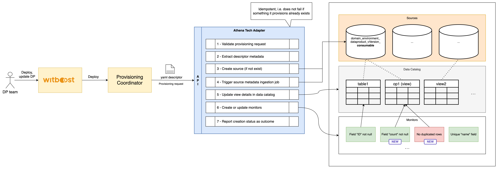
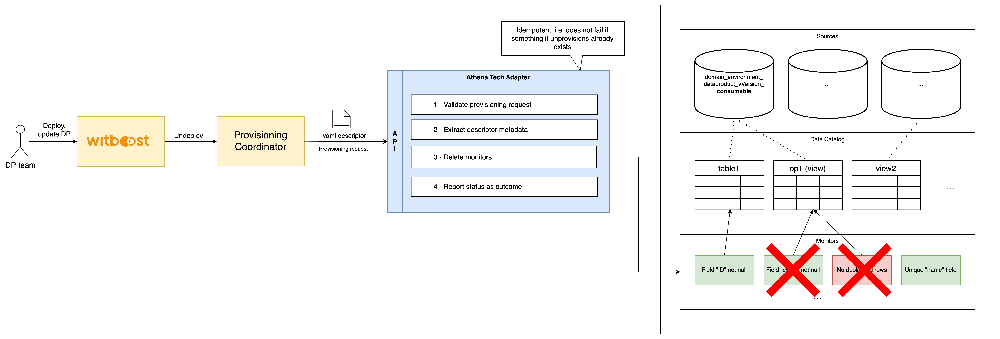

# High Level Design

This document describes the High Level Design of the Sifflet Tech Adapter.
The source diagrams can be found and edited in the [accompanying draw.io file](hld.drawio).

- [Overview](#overview)
- [Provisioning](#provisioning)
- [Unprovisioning](#unprovisioning)
- [Data Quality](#data-quality)

## Overview

### Tech Adapter

A Tech Adapter (TA) is a service in charge of performing a resource allocation task, usually
through a Cloud Provider. The resources to allocate are typically referred to as the _Component_, the
details of which are described in a YAML file, known as _Component Descriptor_.

The TA is invoked by an upstream service of the Witboost platform, namely the Coordinator, which is in charge of orchestrating the creation
of a complex infrastructure by coordinating several TAs in a single workflow. The TA receives
the _Data Product Descriptor_ as input with all the components (because it might need more context) plus the id of the component to provision, named _componentIdToProvision_

To enable the above orchestration a TA exposes an API made up of five main operations:
- validate: checks if the provided component descriptor is valid and reports any errors
- provision: allocates resources based on the previously validated descriptor; clients either receive an immediate response (synchronous) or a token to monitor the provisioning process (asynchronous)
- status: for asynchronous provisioning, provides the current status of a provisioning request using the provided token
- unprovision: destroys the resources previously allocated.
- updateacl: grants access to a specific component/resource to a list of users/groups

### Sifflet Tech Adapter

The **Sifflet Tech Adapter** provides integration with Sifflet to manage data quality operations. It focuses on the creation of Sifflet monitors with the purpose of performing controls an Athena output port.

Currently, this tech Adapter only supports integration between Sifflet and AWS Athena.

---

## Provisioning

This flow enables the automated creation and update of Sifflet sources and monitors.

The main operations executed are:
- Validation:
- Component extraction and parsing
- Sifflet monitors creation and update:
    - Sifflet source linked to the Athena database existence check:
        1. if it **exists**, the process continues idempotently without error
        2. if it **does not exist**, the source is automatically created
    - Triggering of the source metadata ingestion job
    - Update of the output port view metadata in the Sifflet Data Catalog
    - Creation or update of quality monitors associated with the views

## Unprovisioning

This flow allows to delete all the monitors created during the provisioning step.

After a simple parsing of the request, the monitors are deleted. The operation is idempotent and will not fail if a request is made to delete a monitor that does not exist.

## Data Quality

The Sifflet Tech Adapter exposes an additional endpoint to support data quality reporting.

This API enables a micro-frontend to retrieve information about the status of data quality monitors associated with a specific output port.

👉 For detailed information about this endpoint, including request and response examples, refer to the [Data Quality Endpoint Specification](dataQualityEndpoint.md).
